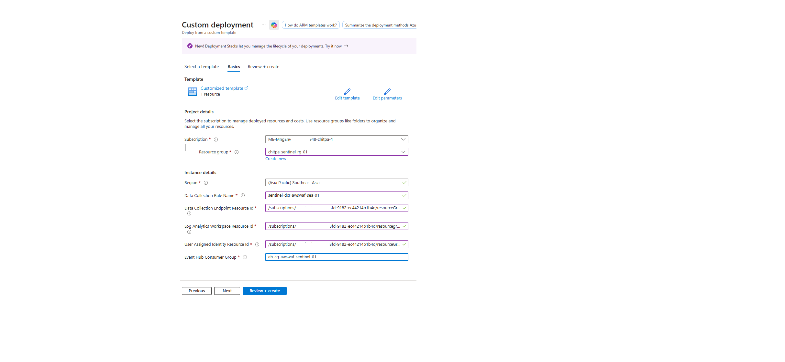

# Data Collection Rule (DCR) Deployment for Event Hub → Microsoft Sentinel

This guide explains how to deploy a Data Collection Rule (DCR) using an ARM template for ingesting Event Hub data (for example, AWS Route53 logs) into Microsoft Sentinel.

---

## 📌 Purpose

This ARM template creates a **Data Collection Rule (DCR)** that:
- Connects to an **Event Hub consumer group**
- Uses **DCE (Data Collection Endpoint)**
- Transforms incoming JSON logs using **KQL transformation**
- Sends data to a **Log Analytics workspace**

---

## ✅ Prerequisites

Ensure you have the following:

- Azure subscription access
- Resource IDs for:
  - Data Collection Endpoint (DCE)
  - Log Analytics Workspace
  - User Assigned Managed Identity
- Event Hub and Consumer Group created

### ✅ Required Permissions

At minimum:
- **Microsoft Sentinel Contributor**
- **Log Analytics Contributor**

---

## 🚀 Deployment Steps (ARM Template via Portal)

### Step 1
Go to Azure Portal and search:
👉 **Deploy a custom template**

### Step 2
Click:
👉 **Build your own template in the editor**

### Step 3
Paste the ARM template provided in this repository

### Step 4
Click **Save** → Proceed to configuration

### Step 5
Fill in the required parameters as shown below (values come from earlier setup steps in the blog):

- Data Collection Rule Name
- Data Collection Endpoint Resource ID
- Log Analytics Workspace Resource ID
- User Assigned Identity Resource ID
- Event Hub Consumer Group (we created the consumer group while creating the EventHubs)

---

## 🖼️ Deployment Example

Below is a sample configuration screen from Azure Portal:

---

## 📂 ARM Template Overview

The template performs the following:

- Creates a **Data Collection Rule (DCR)**
- Attaches **User Assigned Managed Identity**
- Defines **Event Hub data source**
- Declares **Custom Stream**
- Configures **KQL transformation**
- Sends output to **Log Analytics custom table**

---

## 🔁 Data Flow Summary

Event Hub → DCR → KQL Transform → Log Analytics Table

---

## 🧠 Key Design Points

- Uses **Custom Stream**: `Custom-EventHubStreamAWSRoute53`
- Outputs to custom table: `Custom-AWSRoute53Logs_CL`
- Transformation parses `RawData` JSON payload
- Supports structured and dynamic schema evolution

---

## ✅ Output

After deployment:

- DCR is created successfully
- Event Hub ingestion is active
- Logs start flowing into Log Analytics table

---

## ⚠️ Troubleshooting

| Issue | Resolution |
|------|-----------|
| Deployment fails | Validate resource IDs |
| No data ingestion | Check Event Hub consumer group |
| Permission error | Verify RBAC roles |

---

## 📢 Notes

- Ensure DCE and Event Hub are in the same region or properly accessible
- Validate KQL transform using test payloads
- Recommended to monitor ingestion via Log Analytics Logs blade

---

